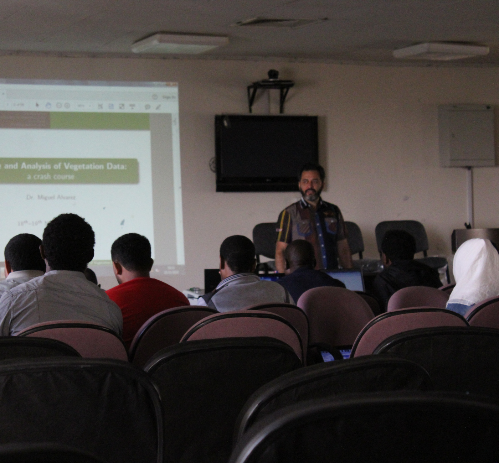
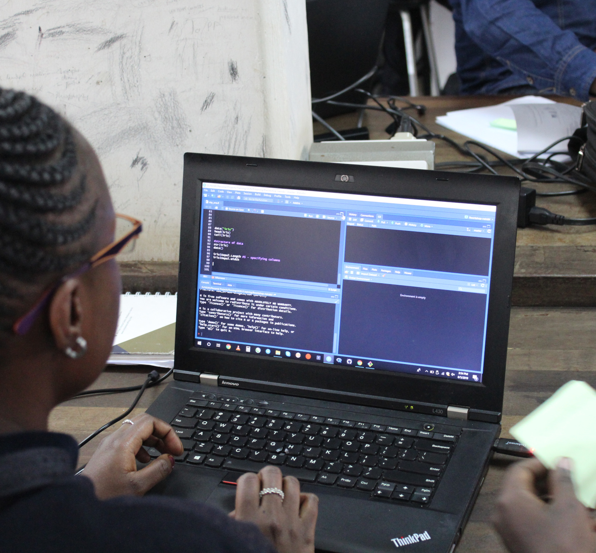
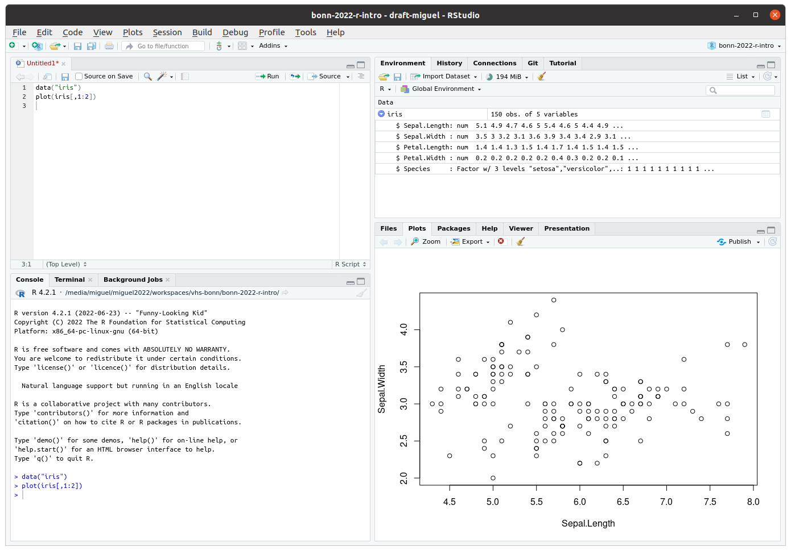
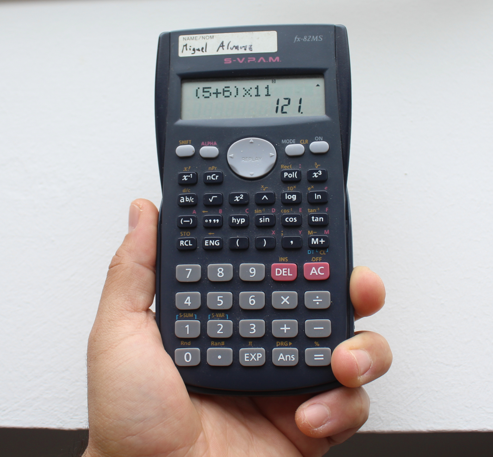
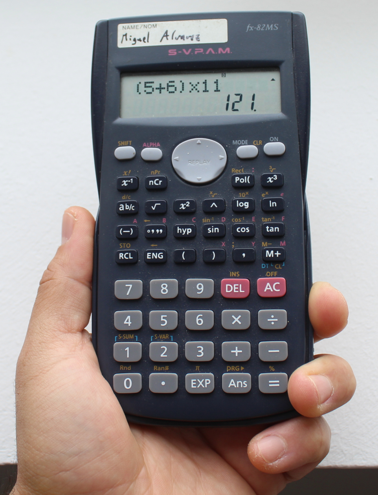
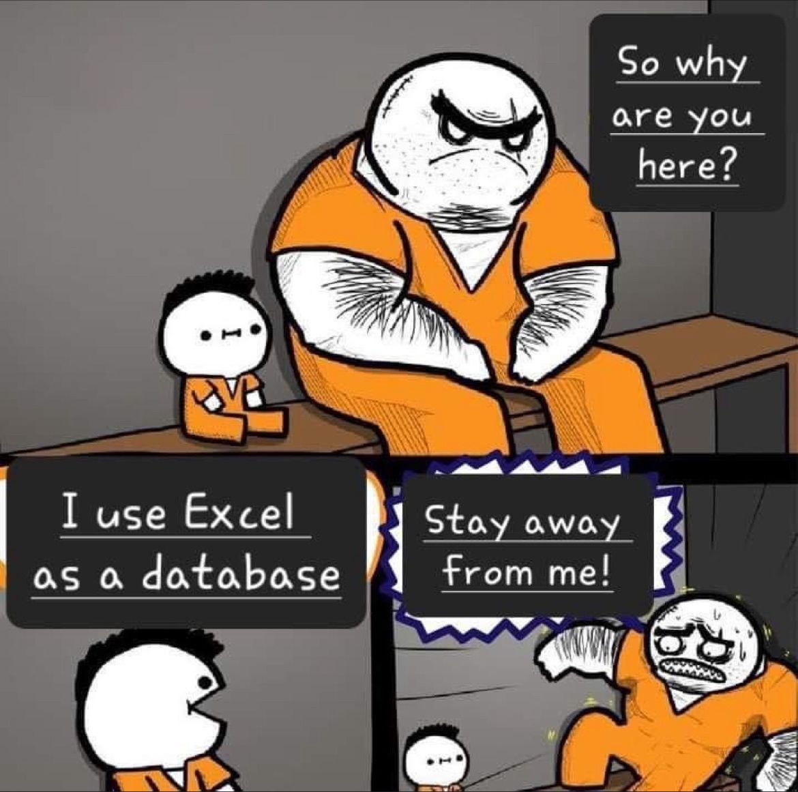
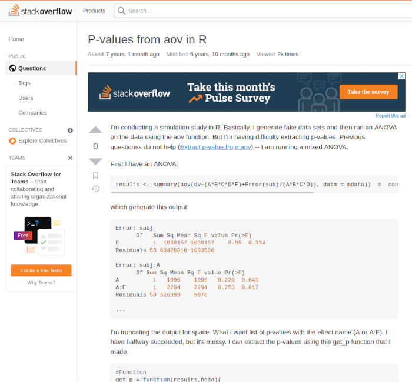

```{r preamble, echo = FALSE, message = FALSE}
library(knitr)

# Set chunk options
opts_chunk$set(
    out.width = "\\textwidth",
    fig.align = "center",
    fig.asp = 0.94,
    fig.width = 6)
```


# Der Kurs

\begincols \begincol{0.5\textwidth}

18:00 -- 20:30

\vspace{0.3cm}

Pause 19:15 -- 19:30

\vspace{0.5cm}

- Methoden
  - Vortrag
  - Life-Codierung
  - Übungen

\vspace{1cm}

\scriptsize

\myurl{https://kamapu.github.io/GrundkursR/}

\endcol \begincol{0.5\textwidth}

```{r echo=FALSE}

```

\endcol \endcols


## Der Kurs

\begincols \begincol{0.5\textwidth}

- **Termin 1 & 2**
  - Grundlagen
  - Datentypen

\vspace{0.5cm}

- **Termin 3 & 4**
  - Objekten (Datenstrukturen)
  - Lesen und Schreiben

\endcol \begincol{0.5\textwidth}

- **Termin 5 & 6**
  - Statistiken
  - Graphiken (1)

\vspace{0.5cm}

- **Termin 7 & 8**
  - Graphiken (2)
  - Fortgeschrittenes Programmieren
  - Abschluss

\endcol \endcols


## Der Kurs

\begincols \begincol{0.5\textwidth}

**Miguel Alvarez**

\vspace{0.2cm}

```{r echo=FALSE}

```

\endcol \begincol{0.5\textwidth}

\vspace{1cm}

\small

- Vegetationsökologist
- Datenwissenschaftler
- KI-Experte
- R (und Python) Programmierer
  - Umwelt und Biodiversität
  - Geographische Informationssystheme
  - Datenbanken
  - Reproduzierbarkeit

  \vspace{0.5cm}

  __*Open Source Aktivist*__

\endcol \endcols


## Der Kurs

\begincols \begincol{0.5\textwidth}

**Die Teilnehmer?**

\vspace{0.5cm}

- Warum R?
- Erwartung von dem Kurs

\endcol \begincol{0.5\textwidth}

```{r echo=FALSE}

```

\endcol \endcols


# Einführung in R

**Geschichte**

\vspace{0.3cm}

- S (1975)
  - S-PLUS
  - TIBCO Spotfire S+
- R (1992)

\vspace{0.5cm}

**R** ist die kostenlose Alternative zu **S**

**R**oss Ihaka\
**R**obert Gentleman

\begin{textblock}{6}(7,-9.5)
\includegraphics[width=\textwidth]{images/logo-r.png}
\end{textblock}


## Einführung in R

\begincols \begincol{0.5\textwidth}

**Was ist R?**

\vspace{0.3cm}

- Programmiersprache
  - Open Source (offene Quelle)
  - Freeware (kostenlos)
- Statistische Umgebung
  - Interface
  - Terminal
  - *Editoren*

\vspace{0.5cm}

\myurl{https://www.r-project.org/}

\endcol \begincol{0.5\textwidth}

```{r echo=FALSE}

```

\endcol \endcols


## Einführung in R

\begincols \begincol{0.5\textwidth}

**Was ist R?**

\vspace{0.3cm}

- Statistisches Programmieren
  - Mathematik
  - Grafiken
- Kommandozeilen
- REPL (Read-Eval-Print-Schleife)

\endcol \begincol{0.5\textwidth}

\scriptsize

```{r}
(5 + 100) * 25
50/10
60 > 15
```

\endcol \endcols


## Einführung in R

\begincols \begincol{0.5\textwidth}

\scriptsize

```{r scatter, eval=FALSE}
plot(Petal.Length ~ Sepal.Length,
      pch = 16, col = Species,
      data = iris)
```

\endcol \begincol{0.5\textwidth}

```{r echo=FALSE}
<<scatter>>
```

\endcol \endcols

## Einführung in R

\begincols \begincol{0.5\textwidth}

\scriptsize

```{r boxplot, eval=FALSE}
boxplot(Sepal.Length ~ Species,
    data = iris)
```

\endcol \begincol{0.5\textwidth}

```{r echo=FALSE}
<<boxplot>>
```

\endcol \endcols


## Einführung in R

\begincols \begincol{0.5\textwidth}

\scriptsize

```{r gscatter, eval=FALSE}
library(ggplot2)
ggplot(iris,
    aes(x = Sepal.Length,
        y = Petal.Length,
        color = Species)) +
  geom_point()
```

\endcol \begincol{0.5\textwidth}

```{r echo=FALSE}
<<gscatter>>
```

\endcol \endcols


## Einführung in R

\begincols \begincol{0.4\textwidth}

**Warum R?**

- Kostet nichts
- Steuerung von Analysen
- Skripten
  - Protokolle
  - Reproduzierbarkeit
- Vielseitig

\endcol \begincol{0.6\textwidth}

\scriptsize

```{r}
# Wir laden zunächst die Daten
data(iris)

# Wir berechnen die Mittelwerte für
# Länge und Breite von Petalen
# per Schwertlilienart
aggregate(cbind(Petal.Length, Petal.Width) ~ Species,
    FUN = mean, data = iris)
```

\endcol \endcols


## Einführung in R

**Wichtige Elemente**

- Konsole
- Sitzung
- Workspace (Environment)
- Arbeitsverzeichnis (working directory)
- Skript
- Paket (Package)


# RStudio

\begincols \begincol{0.35\textwidth}

\footnotesize

- Text Editor
- IDE (integrated development environment)

\endcol \begincol{0.65\textwidth}

```{r echo=FALSE}

```

\endcol \endcols


# R als Taschenrechner

\begincols \begincol{0.5\textwidth}

```{r echo=FALSE}

```

\endcol \begincol{0.5\textwidth}

- Mathematische Operatoren
- Klammern

\vspace{0.2cm}

\scriptsize

```{r}
5+6*11
(5+6)*11
```

\normalsize

\vspace{0.5cm}

- Zuweisung `<-`

\vspace{0.2cm}

\scriptsize

```{r}
M <- 5
M + 2
```

\endcol \endcols

##

\begincols \begincol{0.35\textwidth}



\endcol \begincol{0.65\textwidth}

**Aufgabe 1**

Haben/Hatten Sie einen Taschenrechner?

Erzählen Ihre Geschichte.

\vspace{1.5cm}

**Aufgabe 2**

Taschenrechnen mit R

\endcol \endcols

## Logische Operatoren

\begincols \begincol{0.5\textwidth}

\footnotesize

`==`\
`!=`\
`>`\
`>=`\
`<`\
`<=`\
`&`\
`|`\
`%in%`\
`!`\
`any()`\
`all()`


\endcol \begincol{0.5\textwidth}

\scriptsize

```{r}
10 > 15
10 < 15
```

\endcol \endcols


# Daten in R

\begincols \begincol{0.45\textwidth}



\endcol \begincol{0.55\textwidth}

Which types of data do you know?

\endcol \endcols

## Daten in R

\begincols \begincol{0.5\textwidth}

**Vektoren**

\vspace{0.5cm}

Der Vektor ist die grundlegende Datenstruktur in **R**

\vspace{0.3cm}

- Länge `length()`
- Typ `class()`
- Evtl. Namen `names()`

\endcol \begincol{0.5\textwidth}

\scriptsize

```{r}
c(1:10)
rep(5, times = 10)
LETTERS[1:5]
```

\endcol \endcols

## Daten in R

\begincols \begincol{0.5\textwidth}

**Indexieren**

- Eckige Klammern
- Index
  - `integer`
  - `logical` (Bedingung)
  - `character` (Namen)

\endcol \begincol{0.5\textwidth}

\scriptsize

```{r}
# Mit integer
letters[15]
```
\vspace{0.3cm}

```{r}
# Mit logischen Werten
letters[!letters %in% c("a", "b", "c")]
```
\vspace{0.3cm}

```{r}
# Mit Namen
names(letters) <- letters
letters["m"]
```

\endcol \endcols


## Daten in R

**Datentypen**

\begincols \begincol{0.5\textwidth}

- integer
- numeric
- logical
- factor
- character

\endcol \begincol{0.5\textwidth}

\scriptsize

```{r}
A <- c(1:10)
is.numeric(A)
```

\vspace{0.5cm}

```{r}
B <- as.character(A)
B
is.numeric(B)
```

\endcol \endcols


## Daten in R

\begincols \begincol{0.5\textwidth}

**Sonderklassen**

\vspace{0.3cm}

- `NA`
- `NaN`
- `NULL`
- `Inf`
- `-Inf`

\endcol \begincol{0.5\textwidth}

\scriptsize

```{r}
5/0
log(0)
sqrt(-1)
```

\endcol \endcols

<!--

# Hilfe!

\begincols \begincol{0.5\textwidth}

**Rückmeldungen**

\vspace{0.3cm}

- Konsolenoutput
- Nachricht (`message`)
- Warnung (`warning`)
- Fehlermeldung (`error`)

\vspace{0.3cm}

Eine Warnung ist nicht zwingend ein Fehler.

\endcol \begincol{0.5\textwidth}

\scriptsize

```{r error=TRUE}
sqrt(-1)
5 + "B"
```

\endcol \endcols


## Hilfe!

\begincols \begincol{0.5\textwidth}

**Fehlerbehebung**

\vspace{0.3cm}

- Dokumentation
- Foren
- Programfehler melden

\endcol \begincol{0.5\textwidth}

\scriptsize

```{r eval=FALSE}
# help()
?mean
# help.search()
??"multinomial"
RSiteSearch("Import")
```

\endcol \endcols


## Hilfe!

\begincols \begincol{0.5\textwidth}

**Regeln für Hilfeanfrage**

\vspace{0.3cm}

- Recherechiere vorher
- KESS (*keep it simple stupid*)
- Zeige ein **minimales Beispiel**
- Bleibe höflich
- Melde die Endlösung
- Lerne **markdown**

\vspace{1cm}

\scriptsize

\myurl{https://stackoverflow.com/questions}\
\myurl{https://www.markdowntutorial.com/}

\endcol \begincol{0.5\textwidth}

#```{r echo=FALSE}
#
#```

\endcol \endcols


## Hilfe!

\begincols \begincol{0.5\textwidth}

**Weitere Dokumente**

\vspace{0.3cm}

- Demos
  - `demo()`
- Beispielssitzungen
  - `browsevignette()`
  - `vignette()`
- Zahlreiche Tutorials

\endcol \begincol{0.5\textwidth}

\scriptsize

#```{r eval=FALSE}
#demo("graphics")
#vignette("ggplot2-specs")
#```

\endcol \endcols

-->


#

\LARGE

**Vielen Dank!**

\vspace{1cm}

\scriptsize

```{r}
library(fortunes)
fortune(283)
```
