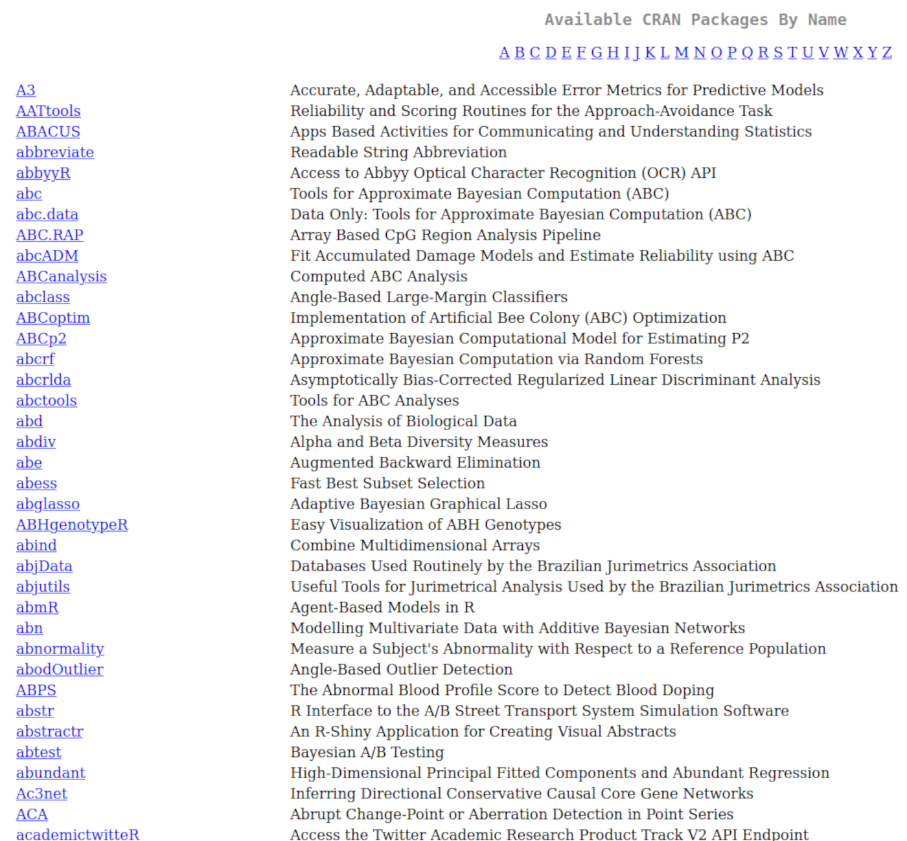
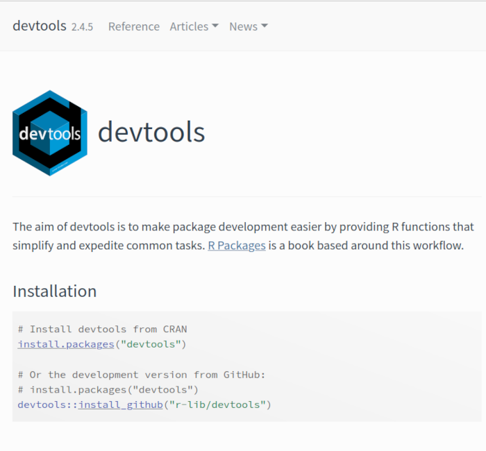
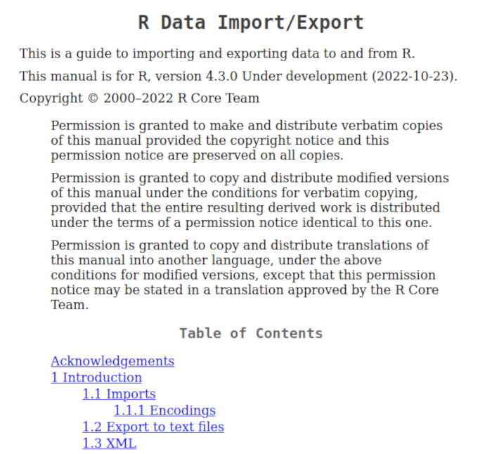

```{r preamble, echo = FALSE, message = FALSE}
library(knitr)

# Set chunk options
opts_chunk$set(
    out.width = "\\textwidth",
    fig.align = "center",
    fig.asp = 0.94,
    fig.width = 6)
```

# Der Kurs

\begincols \begincol{0.5\textwidth}

- **Termin 1 & 2**
  - Grundlagen
  - Datentypen

\vspace{0.5cm}

- **Termin 3 & 4**
  - Objekten (Datenstrukturen)
  - Lesen und Schreiben

\endcol \begincol{0.5\textwidth}

- **Termin 5 & 6**
  - Statistiken
  - Graphiken (1)

\vspace{0.5cm}

- **Termin 7 & 8**
  - Graphiken (2)
  - Fortgeschrittenes Programmieren
  - Abschluss

\endcol \endcols


# Vektoren

\begincols \begincol{0.45\textwidth}


\endcol \begincol{0.55\textwidth}

Which types of data do you know?

\endcol \endcols

## Vektoren

\begincols \begincol{0.5\textwidth}

**Vektoren**

\vspace{0.5cm}

Der Vektor ist die grundlegende Datenstruktur in **R**

\vspace{0.3cm}

- Länge `length()`
- Typ `class()`
- Evtl. Namen `names()`

\endcol \begincol{0.5\textwidth}

\scriptsize

```{r}
c(1:10)
rep(5, times = 10)
LETTERS[1:5]
```

\endcol \endcols

## Vektoren

\begincols \begincol{0.5\textwidth}

**Indexieren**

- Eckige Klammern
- Index
  - `integer`
  - `logical` (Bedingung)
  - `character` (Namen)

\endcol \begincol{0.5\textwidth}

\scriptsize

```{r}
# Mit integer
letters[15]
```
\vspace{0.3cm}

```{r}
# Mit logischen Werten
letters[!letters %in% c("a", "b", "c")]
```
\vspace{0.3cm}

```{r}
# Mit Namen
names(letters) <- letters
letters["m"]
```

\endcol \endcols


## Vektoren

**Datentypen**

\begincols \begincol{0.5\textwidth}

- integer
- numeric
- logical
- factor
- character

\endcol \begincol{0.5\textwidth}

\scriptsize

```{r}
A <- c(1:10)
is.numeric(A)
```

\vspace{0.5cm}

```{r}
B <- as.character(A)
B
is.numeric(B)
```

\endcol \endcols


## Vektoren

\begincols \begincol{0.5\textwidth}

**Sonderklassen**

\vspace{0.3cm}

- `NA`
- `NaN`
- `NULL`
- `Inf`
- `-Inf`

\endcol \begincol{0.5\textwidth}

\scriptsize

```{r}
5/0
log(0)
sqrt(-1)
```

\endcol \endcols


# Objekte

\begincols \begincol{0.5\textwidth}

**Funktion**

\vspace{0.3cm}

`foo(par1 = arg1, ..., parn = argn)`

\vspace{0.5cm}

Funktionen und Argumente (Parameter) werden dokumentiert.

Achte auf Standardeinstellungen (default values).

\endcol \begincol{0.5\textwidth}

\scriptsize

```{r}
A <- c(1, NA, 3, 5)
mean(A)
mean(A, na.rm = TRUE)
```

\endcol \endcols


## Objekte

\begincols \begincol{0.5\textwidth}

**Matrix**

\vspace{0.3cm}

- Typ von Inhalt (`mode()`).
- Zwei Dimensionen.

\endcol \begincol{0.5\textwidth}

\scriptsize

```{r}
M <- matrix(1:20, nrow = 4)
M
class(M)
mode(M)
length(M)
dim(M)
```

\endcol \endcols


## Objekte

\begincols \begincol{0.5\textwidth}

**Liste**

\vspace{0.3cm}

Liste (Sammlung) von Objekten, inklusive Listen.

Achte, dass `data.frame` eine spezielle Form von `list` ist.

\endcol \begincol{0.5\textwidth}

\scriptsize

```{r}
MeineListe <- list(
    A = 1:10,
    B = matrix(1:10, nrow = 2),
    C = "Dies ist eine Liste")
MeineListe
```

\endcol \endcols


## Objekte

\begincols \begincol{0.5\textwidth}

**Datensatz**

\vspace{0.3cm}

Spaltenorientierte Tabelle\
(`data.frame`)

\endcol \begincol{0.5\textwidth}

\scriptsize

```{r}
head(iris)
str(iris)
```

\endcol \endcols


# Pakete

\begincols \begincol{0.5\textwidth}

**CRAN**\
(Comprehensive R Archive Network)

\vspace{0.3cm}

- `install.packages()`
- `update.packages()`

\vspace{0.5cm}

\scriptsize

```{r eval=FALSE}
install.packages("ade4")
update.packages(ask = FALSE)
```

\vspace{0.3cm}

\myurl{https://cran.r-project.org/}

\endcol \begincol{0.5\textwidth}

```{r echo=FALSE}

```

\endcol \endcols


## Pakete

\begincols \begincol{0.5\textwidth}

**devtools**

\vspace{0.3cm}

- `install()`
- `install_github()`

\vspace{1cm}

\scriptsize

\myurl{https://ropensci.org/}

\endcol \begincol{0.5\textwidth}

```{r echo=FALSE}

```

\endcol \endcols


# Import/Export

\begincols \begincol{0.4\textwidth}

- `readLines()`
- `read.table()`
  - `read.csv()`
  - `read.csv2()`

\endcol \begincol{0.6\textwidth}

\scriptsize

```{r}
Bonn2021 <- read.csv("Bevoelkerung-2021.csv")
str(Bonn2021)
```

\endcol \endcols

## Import/Export

\begincols \begincol{0.4\textwidth}

- `readLines()`
- `read.table()`
  - `read.csv()`
  - `read.csv2()`

\vspace{0.5cm}

- `write.table()`
  - `write.csv()`
  - `write.csv2()`

\endcol \begincol{0.6\textwidth}

\scriptsize

```{r eval=FALSE}
write.csv(iris, file = "iris.csv")
write.csv2(iris, file = "iris2.csv")
```

\endcol \endcols


## Import/Export

\begincols \begincol{0.5\textwidth}

Pakete können eigene Funktionen für Importieren und Exportieren anbieten.

\vspace{0.5cm}

- **xlsx**
  - `read.xlsx()`
  - `write.xlsx()`

\vspace{0.5cm}

- **readODS**
  - `read_ods()`
  - `write_ods()`

\endcol \begincol{0.5\textwidth}

```{r echo=FALSE}

```

\endcol \endcols


## Import/Export

\begincols \begincol{0.5\textwidth}

Pakete können eigene Funktionen für Importieren und Exportieren anbieten.

\vspace{0.5cm}

- **xlsx**
  - `read.xlsx()`
  - `write.xlsx()`

\vspace{0.5cm}

- **readODS**
  - `read_ods()`
  - `write_ods()`

\endcol \begincol{0.5\textwidth}

```{r echo=FALSE}

```

\endcol \endcols


## Import/Export

\begincols \begincol{0.5\textwidth}

**R-Images**

\vspace{0.3cm}

- Workspace
  - `save()`
  - `load()`
  - Dateierweiterung **.rda** oder **.RData**

\vspace{0.3cm}

- Einzelnes Objekt
  - `saveRDS()`
  - `readRDS()`
  - Dateierweiterung **.rds**

\endcol \begincol{0.5\textwidth}

\endcol \endcols

#

\LARGE

**Vielen Dank!**

\vspace{1cm}

\scriptsize

```{r}
library(fortunes)
fortune(10)
```
